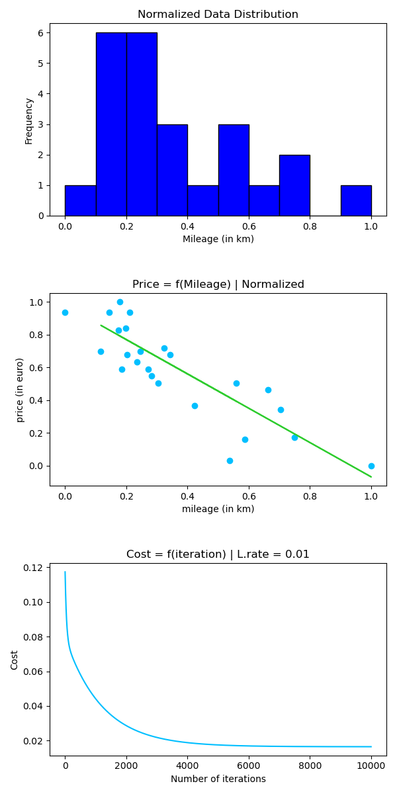

# DataScience x linear_regression | 42Paris
## Objective
To create a linear regression function, train the model on the given dataset, save generated indexes and use 
them to predict car price depending on it's mileage.

## Requirements
Before running the program, make sure you have the following dependencies installed:
  - numpy: A library for numerical computations.
  - pandas: A library for data manipulation and analysis.
  - matplotlib: A library for data visualization.
  - scikit-learn: A machine learning library for data preprocessing and evaluation.
You can install these packages using pip if you don't have them already: pip install numpy pandas matplotlib scikit-learn

## Usage
- git clone https://github.com/shimazadeh/Ft_linear_regression.git Linear-regression
- cd Linear-regression
- python3 main.py [path/to/dataset.csv] [#iteration] [learning_rate] [mode]
- There are two modes to the program:
  - mode 1: finds the best thetas to be initialized using hyperparameter tuning technique
  - mode 2: uses the parameters from best_params.json file created in the previous option and train and test the model based on that.

## Approach
- Data Preprocessing: The program reads the dataset from the CSV file, normalizes the data to the range of 0-1.
- Train-Test Splitting: The program splits the dataset into training and test sets.
- Hyperparameter Tuning: It uses hyperparameter tuning method to find the best initial parameters (thetas) for the linear regression model.
- Model Training: The linear regression model is trained using gradient descent. The program provides options to visualize the training process and print the
  model parameters, Loss, MSE and MAE each iteration.
- Model Evaluation: After training, the program predicts prices using the test set and calculates the Mean Squared Error (MSE) and Mean Absolute Error (MAE)
  to evaluate the model's performance.
- Visualization: The program visualizes the normalized dataset, the regression model, and the cost function as shown below:
  
